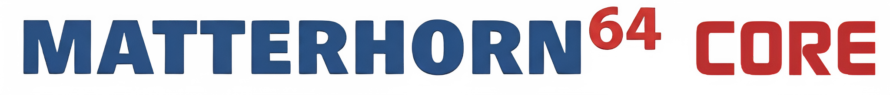
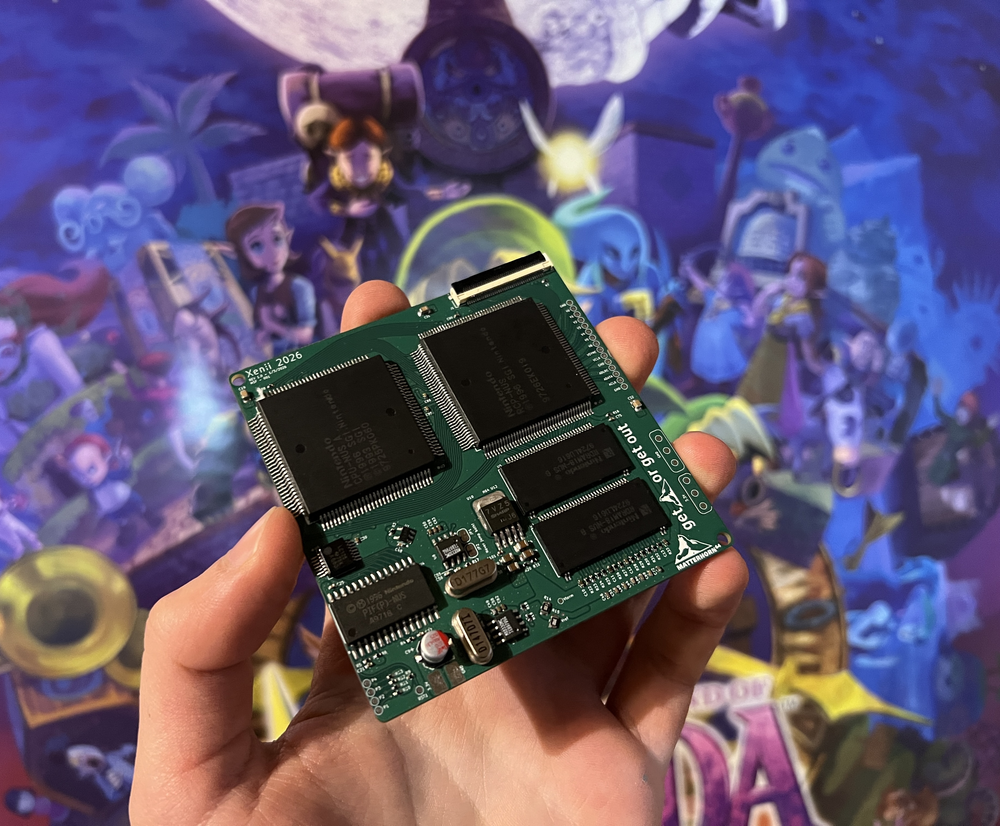
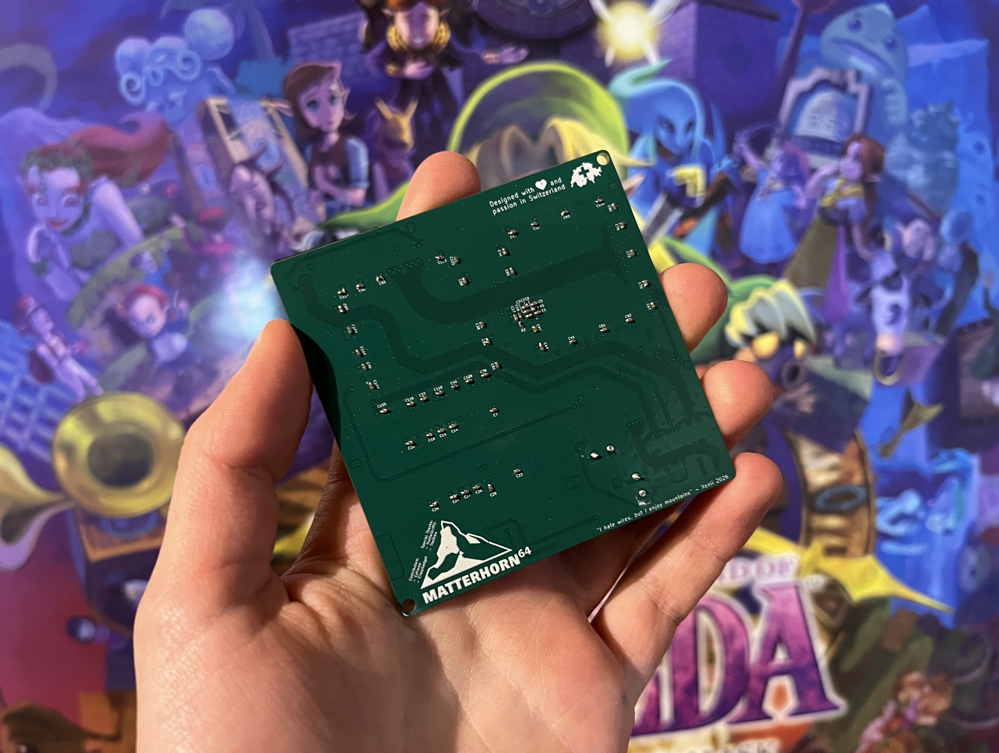
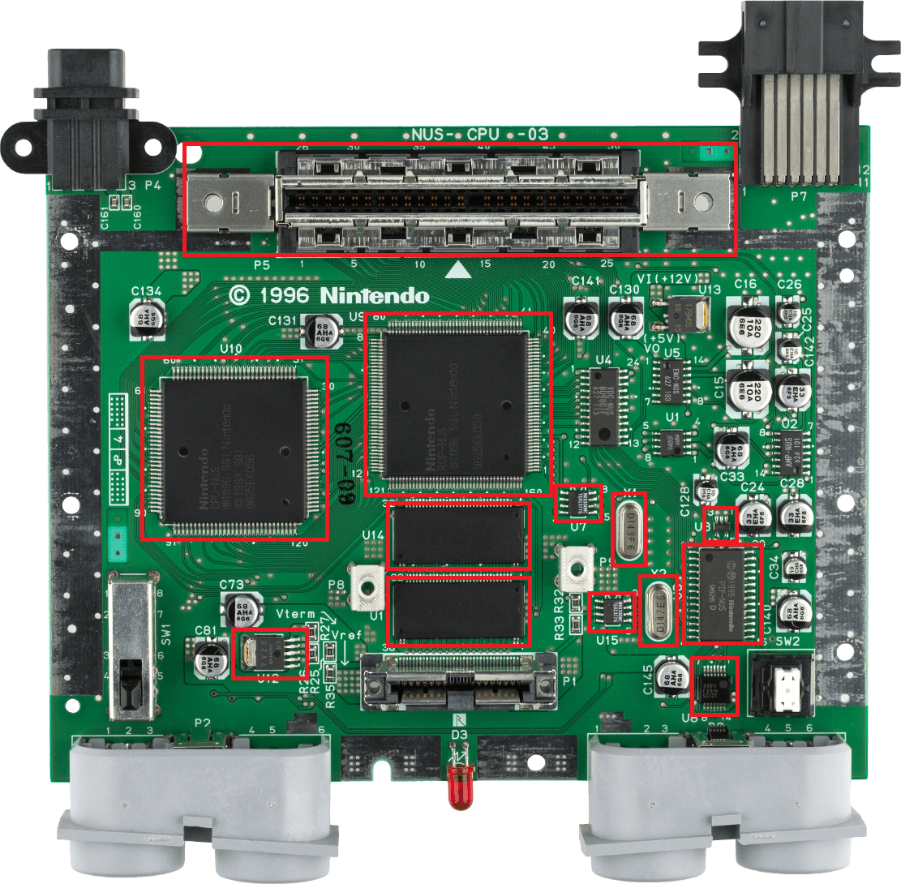
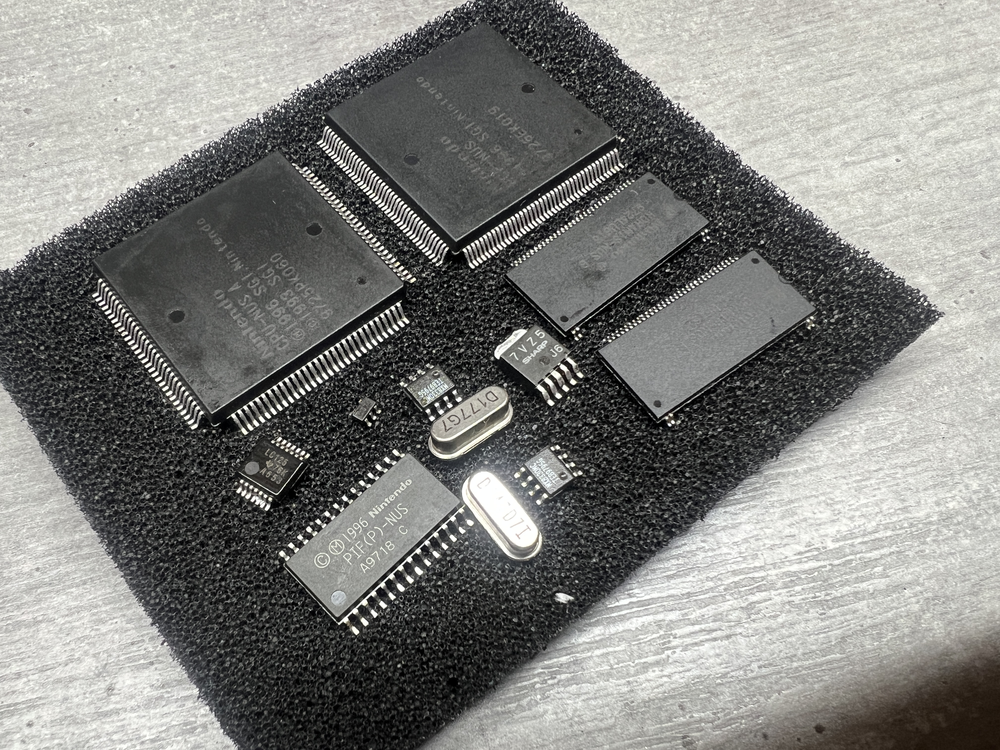
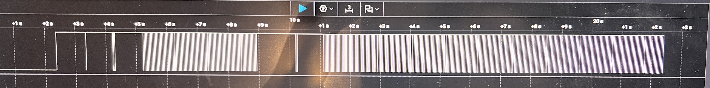

 
 

Matterhorn 64 CORE is the world's smallest open-source Nintendo 64 motherboard redesign. 
It relies on the original components taken from an original Nintendo 64 console. 
Since it does **not** rely on emulation, it works perfectly with all the games ever released on the system. 

This board redesign offers smaller, better, cleaner and more reliable builds. 
Matterhorn 64 CORE can easily be integrated in different kinds of builds such as Nintendo 64 portables devices or mini consoles. 

It is fully open-source and released under the CERN-OHL-S-2.0 license. 

## Features
The Matterhorn 64 CORE redesign:
- The world's smallest open source Nintendo 64 motherboard
- Fits in a tiny 78x77.2 mm form factor 
- Runs on real hardware, **no emulation**
- 100% original with **all** the games released on the system, including flashcarts
- Runs on 3.3V @2A 
- Designed on KiCad 9
- Optimized for clean and optimized Nintendo 64 portable builds
- 100% open-source and release under the CERN-OHL-S-2.0 license

## Compatibility
### General compatbility
Due to the complexity of the Nintendo 64 hardware, some of its feature are not availble on this design. 
Please note that:
- The console is compatible with both NTSC and PAL console. However, it is **NOT** region free. It will only accepts games release on the same region as the donor board.
- The console does accept memory expansion, but it is not natively compatible with the orignal Expansion Pak cartridge. You'll need to solder two RDRAM36 4MB onto the console instead of the two RDRAM18 2MB chips present by default on the console in order to enable the Expansion Pak.
- The console does **NOT** have any video output system. You'll either need to hock up an original composite encoder compatible with your region or an HDMI kit
- The console does **NOT** have on-board voltage regulators. An additional N64 PSU or 3.3V PSU will be needed in order to use it. The console requires only requires 3.3V at 2A, but please consider that some HDMI mod or composite encoders may require 5V as well.
- The console is compatible with original controllers
- It is also compatible with original cartridges using the breakout board.

### Nintendo 64 donor board revision compatibility
This mod is **ONLY** compatible with the following motherboard revisions:
#### NTSC Revisions (North America and Japan)
- NUS-CPU-01 (Japan only - 1996)
- NUS-CPU-02 (1996)
- NUS-CPU-03 (1996)
- NUS-CPU-04 (1996-1997)
- NUS-CPU-05 (1997)
- NUS-CPU-05-1 (1997)
- NUS-CPU-06 (1998)
- NUS-CPU-07 (1998)

#### PAL REVISION (Europe and Australia)
- NUS-CPU(P)-01 (1996)
- NUS-CPU(R)-01 (France only - 1997)

**ANY NEWER REVISION WILL NOT BE COMPATIBLE**

## Disclamer
This project requires advanced soldering techniques. It relies on small pitch QFP and 0402 passives.
Removing the components from the original board can be fatal for them if done incorrectly.

Due to the nature of this project, I am not responsible for any physical damages that may occur. 

## PCB Files
The Matterhorn 64 CORE motherboard has been entirely designed using KiCad 9. 
All the files are available in the KiCad files folder of this repository. 
The libraries created are also available in that same folder. 

Gerbers can be found in the Gerber folder. 

The console needs those two PCBs in order to make it work:
- Matterhorn 64 CORE redesign
- Matterhorn Cartridge Breakout

The CORE itself represents the main logic of the console. The breakout board is used easily connect a full size game cartridge to the console. 

## Ordering
For this project, I recommand ordering the board through JLCPCB or PCBWay. 
I personally ordered mine through JLCPCB. 

You'll find here the list of settings that must be applied when ordering. 

### Matterhorn 64 CORE
- Material: FR4
- Layers: 4
- Thickness: 1.6mm
- Specify Stackup: YES - JLC0416H-3313
- Impedance Control: ±10%
- Stencil: Recommanded but not obligatory.

### Matterhorn Cartridge Breakout
- Material: FR4
- Layers: 2

### Board Impedance Control
As you might notice, the CORE requires controlled impedance. 
The Nintendo 64 uses an extremely fast Rambus Dynamic Random Access Memory Bus (RDRAM BUS). 
In order to work, the CORE requires controlled impedance to match the 50Ω required by the RDRAM BUS. 

The Gerbers files for this board inclues an Excel document which specifies which traces require those controller impedance. 

Please note that the board **might** work by using the 3313 stackup with no controlled impedance. 
To make sure my prototype was working, I did order it using those specifications. 
Ordering without it has not been tried and is at your own risks. 

All the components are listed in the Bill Of Material file (BOM). They can be ordered through Digikey or Mouser. 

## Assembly 
Once you've found a working Nintendo 64 console, a few games to test it, all the components and the Matterhorn 64 CORE boards, assembly can begin!
First of all, you'll need to access the Nintendo 64 motherbaord and remove all those components:
- CPU-NUS (U10)
- RCP-NUS (U9)
- 2x RDRAM18-NUS (U14 & U11) (or 1x RDRAM36 depending of the version, U14)) 
- NUS-PIF (U6)
- PTS9128 (U3)
- 74LCV125 (U8)
- 2x MX8330 (U7 & U15)
- 2x Crystals (X1 & X2)
- Sharp 7VZ5 LDO (U12)
- Cartridge slot (P5)

I personally removed mine using hot air and a bit of flux. I heated at 360°C. 
Once removed, they can take place on the new motherboard. 
Low melting solder is not recommanded in this process since the board will heat and cool down constantly when running, which can damage the solders after a long time. It is also not recommanded to heat either the board or the components too much, which could lead to issues. 
I recommand soldering the whole front side and then solder the back side. 

The breakout board is much simpler, it only has a single FFC connector and the cartridge slot, which are much easier to solder than the little passives in my opinion. 

Once everything is done and cleaned using isopropylic alcohol, the test process can begin!

## Testing
First, connect the breakout board and make sure you don't have any dead shorts between the 3.3V line and the GND. 
Then, insert a game and power it up! The board is properly powered if:
- The console draws roughly 1.4A
- Vterm shows 2.55V
- Vshows shows 1.91V

If you own a logic analyzer, you can connect it to the audio data pins and controller ports.
This is what you should see on the controller data line when a controller is plugged on Super Mario 64

If everything seems good, you can hock up an HDMI mod or composite encoder and test it out! If it displays, it works! Great job!

## Known issue:
When I assembled my prototype, I probably heated the CPU too much while removing it. This caused the console to only work if heated.
More tests will be done to understand what exactly caused that. 

Even though that issue is annoying, I wanted to mention the board worked flawlessly for multiple consecutive days. 

## Credits
This project was the most complicated I've done. Hopefully, some people of the BitBuilt community helped me out to make my journey easier.
Therefore, I wanted to address big thanks to:
- @cyframe who collaborated with me on some part of the design, especially footprints
- @crazygadget who made great open-source flexes which helped me understanding some part of the console
- @mackieks who answered all my technical questions and took the time to review the whole board
- @thedrew and @gunnar who gave me insiparation to design my own motherboard recreation as long as helping me throughout the process.

## Media
You can find a video of my working board on my Instagram account:
[Matterhorn 64 CORE working](https://www.instagram.com/reel/DWvlAQKiPuf/)

## License
Matterhorn 64 CORE is released under the CERN-OHL-S-2.0 license. 
This license allows you to:
- Study
- Modify
- Manufacture
- Sell
- Distribute

Any modified versions of derivatives must also remain open-source under **the exact same license**

## Support
If you notice anything wrong with the desing, if you would looking for answer to questions, help or advice or if you just have ideas to upgrade that project, please let me know!

Thanks everybody for the support and see you next time!

 

